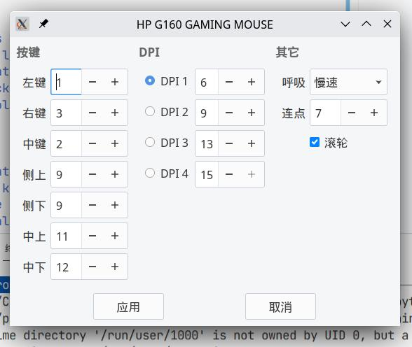

# HP G160 GAMING MOUSE

A simple driver for **HP G160 GAMING MOUSE** implemented using `Python`, `pyusb` and `PyQt5`.

## Feature

- Setting keys by **key code**.
- Setting DPI level.
- Setting breath light speed.
- Setting click speed.
- Setting scroll (roller) enable / disable.

## TODO

- [ ] Implement mouse macros.
- [ ] Provide key code table.
- [ ] Increase configuration file storage.
- [ ] Dynamically sniff mouse state.
